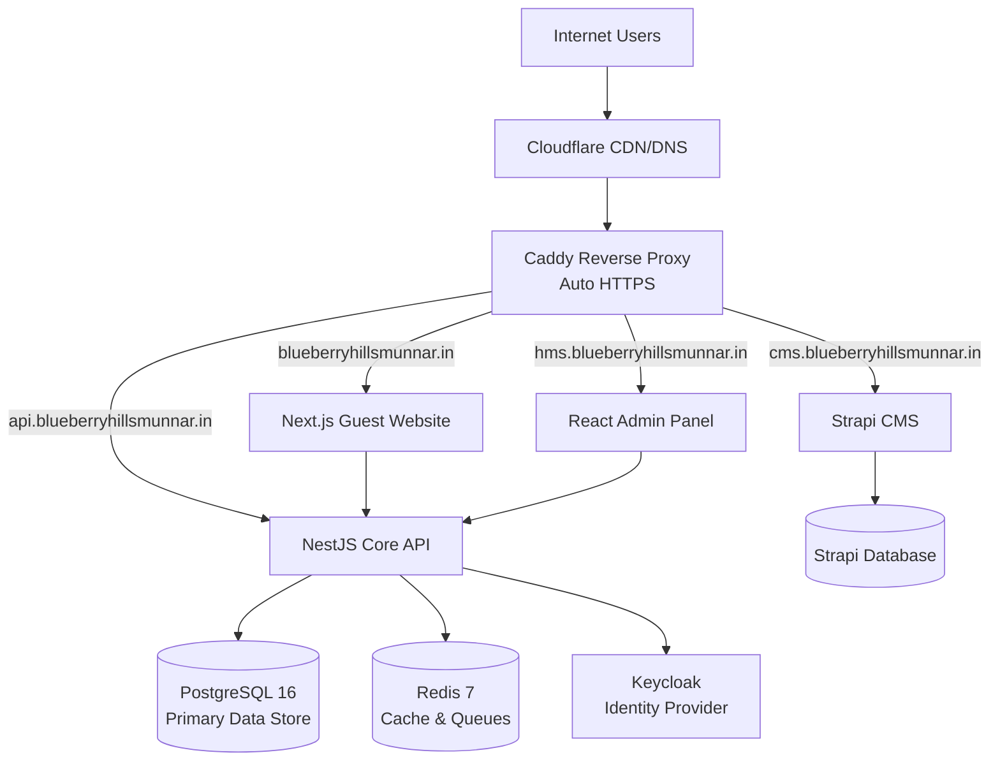

# 🏨 Blueberry HMS (Hotel Management Suite)

**Version:** 1.0.0 - Phase 5 (Frontend Foundation In Progress)  
**Property:** Blueberry Hills Resort, Munnar | **Owner:** Mattel Group  
**Development Status:** ~50% Complete | **Last Updated:** January 2025

---

## 📖 Table of Contents
1. [Project Overview](#-project-overview)
2. [Current System Status](#-current-system-status)
3. [Architecture](#-architecture)
4. [Technology Stack](#-technology-stack)
5. [Installation & Setup](#-installation--setup)
6. [Database Schema](#-database-schema)
7. [API Documentation](#-api-documentation)
8. [Frontend Applications](#-frontend-applications)
9. [Security & RBAC](#-security--rbac)
10. [Development Workflow](#-development-workflow)
11. [Project Roadmap](#-project-roadmap)
12. [Testing & Quality Assurance](#-testing--quality-assurance)

---

## 🎯 Project Overview

Blueberry HMS is a **production-grade, modular Hotel Management Operating System** designed for **on-premise deployment**. Built for Blueberry Hills Resort in Munnar, it serves as both a property-specific solution and a reusable HMS product.

### Core Philosophy
- **Data Sovereignty:** Complete control over data via self-hosted infrastructure
- **Strict MVC Architecture:** Clean separation of Model, View, and Controller layers
- **Audit-First Compliance:** Every state-changing operation logged for financial/legal compliance
- **Headless API Design:** Backend API serves multiple frontends (Web, Admin, Kiosk, Mobile-ready)
- **Feature Flag System:** Modules can be enabled/disabled via Super Admin panel

### Design Principles
- **Modular Monolith:** All services in one repository but strictly separated by domain
- **Domain-Driven Design (DDD):** Business logic organized by hotel operations domains
- **Production-Ready Security:** JWT authentication, bcrypt hashing, input sanitization via DTOs
- **Enterprise Logging:** File-based daily rotation with audit trail retention

---

## 📊 Current System Status

### ✅ **Completed Phases (100%)**

#### **Phase 1: Infrastructure & DevOps**
- ✅ Docker Compose orchestration (PostgreSQL 16, Redis 7, Keycloak, PgAdmin)
- ✅ Monorepo structure with Turborepo + pnpm workspaces
- ✅ Environment configuration management (.env system)
- ✅ Development tooling and hot-reload setup

#### **Phase 2: Core Backend & Security**
- ✅ **Authentication System:** JWT tokens, login/register, password hashing
- ✅ **User Management:** 8 role-based access levels (SUPER_ADMIN to GUEST)
- ✅ **Audit Logging:** Complete trail of all CREATE/UPDATE/DELETE operations
- ✅ **Global Exception Handling:** Standardized error responses
- ✅ **Input Validation:** DTO-based sanitization on all endpoints

#### **Phase 3: Property & Room Management**
- ✅ **Property Configuration:** Multi-property support ready
- ✅ **Amenities System:** Reusable room features (WiFi, AC, Balcony, etc.)
- ✅ **Room Types:** Categories with pricing, capacity, bed types, view types
- ✅ **Room Inventory:** Individual rooms (101, 102...) with status tracking
- ✅ **Status Management:** 6 states (Available, Occupied, Cleaning, Maintenance, Out of Service, Inspection)

#### **Phase 4: Booking Engine & Guest Management**
- ✅ **Guest Profiles:** Complete customer database with history and preferences
- ✅ **Booking System:** Full reservation lifecycle management
- ✅ **Availability Engine:** Date conflict checking, prevents double-booking
- ✅ **Check-in/Check-out:** Automated workflows with room status updates
- ✅ **Payment Tracking:** Multiple payment methods, balance calculation
- ✅ **Confirmation System:** Auto-generated booking numbers (BH + date + sequence)

#### **Phase 4.5: Logging Infrastructure**
- ✅ **Backend Logging:** Daily rotating files (application, error, audit logs)
- ✅ **Frontend Logging:** Browser console + localStorage persistence
- ✅ **HTTP Request Logging:** Timing and performance metrics
- ✅ **Error Boundaries:** React crash protection with logging

#### **Phase 4.8: Testing Framework**
- ✅ **Backend Tests:** Jest configuration with 10 passing unit tests
- ✅ **Frontend Tests:** Vitest + React Testing Library (3 passing tests)
- ✅ **Load Testing:** k6 scripts for performance validation
- ✅ **Test Documentation:** Complete TESTING.md guide

### 🚧 **In Progress (60%)**

#### **Phase 5: Frontend Admin Panel**
- ✅ **Authentication UI:** Login page with JWT integration
- ✅ **Layout System:** Sidebar navigation, user profile dropdown
- ✅ **Bookings Management:** View all bookings, check-in/check-out actions, payment recording
- ✅ **Rooms Management:** Grid view with status filtering, details modal, status updates
- ✅ **Dashboard:** Basic welcome page (stats pending)
- ⚠️ **Missing:** Create Booking Form, Guest Management UI, Dashboard Statistics

---

## 🏗 Architecture

### System Overview


### Deployment Architecture
- **On-Premise Server:** All services run on a single Ubuntu/Debian server
- **Cloudflare Tunnels:** Secure external access without port forwarding
- **Docker Network:** Internal isolation with named container networking
- **Persistent Volumes:** Database and uploads mapped to host filesystem

---

## 💻 Technology Stack

| Layer | Technology | Version | Purpose |
|-------|------------|---------|---------|
| **Backend Framework** | NestJS | ^10.0.0 | API server with modular architecture |
| **Language** | TypeScript | ^5.0.0 | Type-safe development |
| **Database** | PostgreSQL | 16-alpine | Primary relational data store |
| **ORM** | TypeORM | ^0.3.20 | Database abstraction & migrations |
| **Cache** | Redis | 7-alpine | Session storage & job queues |
| **Authentication** | JWT + Passport | Latest | Stateless authentication |
| **Password Security** | Bcryptjs | ^2.4.3 | Hashing (10 rounds, WSL-compatible) |
| **Identity Management** | Keycloak | Latest | SSO & OAuth provider (planned) |
| **API Documentation** | Swagger | ^7.0.0 | Auto-generated OpenAPI docs |
| **Admin Frontend** | React + Vite | ^18.2 / ^5.0 | Staff operating system UI |
| **Guest Website** | Next.js | ^14.0.0 | SEO-optimized public site (planned) |
| **UI Framework** | TailwindCSS | ^3.4.0 | Utility-first styling |
| **State Management** | Zustand | ^4.5.0 | Lightweight React state |
| **HTTP Client** | Axios | ^1.6.0 | API communication |
| **CMS** | Strapi | ^4.0.0 | Headless content management (planned) |
| **Reverse Proxy** | Caddy | ^2.7.0 | Automatic HTTPS & routing |
| **Container** | Docker | ^24.0.0 | Isolated service deployment |
| **Orchestration** | Docker Compose | ^2.0.0 | Multi-container management |
| **Package Manager** | pnpm | ^8.0.0 | Fast, disk-efficient dependency management |
| **Monorepo** | Turborepo | ^1.11.0 | Build system optimization |
| **Testing (Backend)** | Jest | ^29.0.0 | Unit & integration tests |
| **Testing (Frontend)** | Vitest | ^1.0.0 | Fast Vite-native testing |
| **Load Testing** | k6 | ^0.48.0 | Performance & stress testing |

---

## 🚀 Installation & Setup

### Prerequisites
```bash
# Required software
- Docker v24+ & Docker Compose v2+
- Node.js v18+ (LTS recommended)
- pnpm v8+
- Git

# Optional
- pgAdmin 4 (database management)
- Postman (API testing)
```

### Quick Start (Development)

#### 1. Clone & Install Dependencies
```bash
git clone https://github.com/Josepharun07/Blueberry-HMS.git
cd blueberry-hms
pnpm install
```

#### 2. Environment Configuration
```bash
# Copy example environment file
cp .env.example .env

# Edit .env and update:
# - DB_PASSWORD (strong password for PostgreSQL)
# - JWT_SECRET (random 64+ character string)
# - API_PORT (default: 4000)
# - ADMIN_PORT (default: 5173)
```

#### 3. Launch Infrastructure
```bash
# Start PostgreSQL, Redis, Keycloak, PgAdmin
pnpm run docker:up

# Verify services are running
docker ps
```

#### 4. Initialize Database
```bash
# Run migrations to create schema
cd apps/api-core
pnpm run migration:run

# Seed sample data (optional)
pnpm run seed
```

#### 5. Start Applications
```bash
# Option A: Start everything
pnpm run dev

# Option B: Start individually
pnpm run dev:api      # Backend API only
pnpm run dev:admin    # Admin panel only
```

#### 6. Verify Installation
```bash
# Check API health
curl http://localhost:4000/api/v1/health

# Access services
API Docs:     http://localhost:4000/api/docs
Admin Panel:  http://localhost:5173
PgAdmin:      http://localhost:5050
```

### Production Build
```bash
# Build all applications
pnpm run build

# Start production API
pnpm run start:api

# Serve admin panel (requires web server)
cd apps/admin-panel/dist
npx serve -s
```

---

## 🗄 Database Schema

### Entity Relationship Overview
```
Properties (Hotel Configuration)
    ↓
Room Types (Deluxe, Suite, etc.)
    ↓ (many-to-many)
Amenities (WiFi, AC, Balcony)
    ↓
Rooms (101, 102, 103...)
    ↓
Bookings ← Guests (Customer Profiles)
    ↓
Payments (Transaction Records)

Users (Staff Authentication)
    ↓
Audit Logs (Compliance Trail)
```

### Core Tables

#### **properties**
- `id` (UUID, PK)
- `name` (VARCHAR) - "Blueberry Hills Resort"
- `domain_url` (VARCHAR) - "blueberryhillsmunnar.in"
- `logo_path` (VARCHAR)
- `settings` (JSONB) - Feature flags, configurations
- `created_at`, `updated_at` (TIMESTAMP)

#### **users**
- `id` (UUID, PK)
- `email` (VARCHAR, UNIQUE) - Login credential
- `password` (VARCHAR) - Bcrypt hashed
- `first_name`, `last_name` (VARCHAR)
- `role` (ENUM) - SUPER_ADMIN | OWNER | MANAGER | FRONT_DESK | HOUSEKEEPING | KITCHEN | POS | GUEST
- `status` (ENUM) - ACTIVE | INACTIVE | SUSPENDED
- `created_at`, `updated_at` (TIMESTAMP)

#### **amenities**
- `id` (UUID, PK)
- `name` (VARCHAR) - "Air Conditioning"
- `description` (TEXT)
- `icon` (VARCHAR) - Icon identifier
- `is_premium` (BOOLEAN) - Extra charge flag
- `display_order` (INTEGER)
- `is_active` (BOOLEAN)

#### **room_types**
- `id` (UUID, PK)
- `name` (VARCHAR) - "Deluxe Valley View"
- `tagline` (VARCHAR) - Marketing subtitle
- `description` (TEXT)
- `base_price` (DECIMAL) - Nightly rate in INR
- `max_occupancy` (INTEGER)
- `size_sqft` (INTEGER)
- `bed_type` (ENUM) - KING | QUEEN | DOUBLE | TWIN | TWIN_DOUBLE | BUNK | SOFA_BED
- `view_type` (ENUM) - VALLEY | MOUNTAIN | GARDEN | CITY | POOL | COURTYARD | NO_VIEW
- `has_balcony`, `has_kitchen` (BOOLEAN)
- `is_active` (BOOLEAN)

#### **rooms**
- `id` (UUID, PK)
- `room_number` (VARCHAR, UNIQUE) - "101", "202"
- `floor_number` (INTEGER)
- `room_type_id` (UUID, FK)
- `status` (ENUM) - AVAILABLE | OCCUPIED | CLEANING | MAINTENANCE | OUT_OF_ORDER | INSPECTION
- `custom_rate` (DECIMAL) - Override base price
- `notes` (TEXT)
- `last_cleaned_at`, `last_inspected_at` (TIMESTAMP)

#### **guests**
- `id` (UUID, PK)
- `first_name`, `last_name` (VARCHAR)
- `email`, `phone` (VARCHAR)
- `address`, `city`, `country` (VARCHAR)
- `id_type` (ENUM) - PASSPORT | DRIVERS_LICENSE | AADHAAR | VOTER_ID | OTHER
- `id_number` (VARCHAR)
- `preferences` (JSONB) - Dietary, room preferences
- `total_bookings` (INTEGER) - Auto-calculated
- `total_spend` (DECIMAL) - Lifetime value

#### **bookings**
- `id` (UUID, PK)
- `booking_number` (VARCHAR, UNIQUE) - "BH260306XXXX"
- `guest_id` (UUID, FK)
- `room_id` (UUID, FK)
- `room_type_id` (UUID, FK)
- `check_in_date`, `check_out_date` (DATE)
- `number_of_guests` (INTEGER)
- `room_rate` (DECIMAL) - Locked-in nightly rate
- `number_of_nights` (INTEGER) - Auto-calculated
- `subtotal`, `tax_amount`, `total_amount` (DECIMAL)
- `paid_amount`, `balance_due` (DECIMAL)
- `status` (ENUM) - DRAFT | PENDING_PAYMENT | CONFIRMED | CHECKED_IN | CHECKED_OUT | CANCELLED | NO_SHOW
- `payment_status` (ENUM) - PENDING | PARTIAL | PAID | REFUNDED
- `special_requests` (TEXT)
- `cancellation_reason` (TEXT)
- `checked_in_at`, `checked_out_at` (TIMESTAMP)

#### **payments**
- `id` (UUID, PK)
- `booking_id` (UUID, FK)
- `amount` (DECIMAL)
- `payment_method` (ENUM) - CASH | CARD | UPI | BANK_TRANSFER | ONLINE | OTHER
- `payment_date` (TIMESTAMP)
- `reference_number` (VARCHAR)
- `notes` (TEXT)
- `created_by` (UUID, FK → users)

#### **audit_logs**
- `id` (UUID, PK)
- `entity_name` (VARCHAR) - Table/module affected
- `entity_id` (UUID) - Record ID
- `action` (ENUM) - CREATE | UPDATE | DELETE
- `user_id` (UUID, FK)
- `ip_address` (VARCHAR)
- `old_values`, `new_values` (JSONB)
- `created_at` (TIMESTAMP)

### Naming Conventions
- **Tables:** `snake_case` plural (e.g., `room_types`, `audit_logs`)
- **Columns:** `snake_case` (e.g., `check_in_date`, `total_amount`)
- **Primary Keys:** Always `id` (UUID v4)
- **Foreign Keys:** `{entity}_id` (e.g., `guest_id`, `room_type_id`)
- **Timestamps:** `created_at`, `updated_at`, `deleted_at` (soft delete)

---

## 📚 API Documentation

**Base URL:** `http://localhost:4000/api/v1`  
**Swagger Docs:** `http://localhost:4000/api/docs`

### 🔑 Authentication Endpoints

#### Register New User
```http
POST /auth/register
Content-Type: application/json

{
  "email": "staff@blueberryhillsmunnar.in",
  "password": "SecurePass123!",
  "firstName": "John",
  "lastName": "Doe",
  "role": "FRONT_DESK"
}

Response: 201 Created
{
  "id": "uuid",
  "email": "staff@blueberryhillsmunnar.in",
  "firstName": "John",
  "lastName": "Doe",
  "role": "FRONT_DESK",
  "status": "ACTIVE"
}
```

#### Login
```http
POST /auth/login
Content-Type: application/json

{
  "email": "staff@blueberryhillsmunnar.in",
  "password": "SecurePass123!"
}

Response: 200 OK
{
  "access_token": "eyJhbGciOiJIUzI1NiIsInR5cCI6IkpXVCJ9...",
  "user": {
    "id": "uuid",
    "email": "staff@blueberryhillsmunnar.in",
    "firstName": "John",
    "role": "FRONT_DESK"
  }
}
```

#### Get Current User
```http
GET /auth/me
Authorization: Bearer {token}

Response: 200 OK
{
  "id": "uuid",
  "email": "staff@blueberryhillsmunnar.in",
  "firstName": "John",
  "lastName": "Doe",
  "role": "FRONT_DESK",
  "status": "ACTIVE"
}
```

### 🏨 Room Management Endpoints

#### List All Room Types
```http
GET /room-types
Authorization: Bearer {token}

Response: 200 OK
[
  {
    "id": "uuid",
    "name": "Deluxe Valley View",
    "basePrice": 5500,
    "maxOccupancy": 3,
    "bedType": "KING",
    "viewType": "VALLEY",
    "amenities": [
      {"name": "Air Conditioning", "isPremium": false},
      {"name": "WiFi", "isPremium": false}
    ]
  }
]
```

#### List Available Rooms
```http
GET /rooms?status=AVAILABLE
Authorization: Bearer {token}

Response: 200 OK
[
  {
    "id": "uuid",
    "roomNumber": "101",
    "floorNumber": 1,
    "status": "AVAILABLE",
    "roomType": {
      "name": "Deluxe Valley View",
      "basePrice": 5500
    }
  }
]
```

#### Update Room Status
```http
PATCH /rooms/{id}/status/CLEANING
Authorization: Bearer {token}

Response: 200 OK
{
  "id": "uuid",
  "roomNumber": "101",
  "status": "CLEANING",
  "lastCleanedAt": "2025-01-15T10:30:00Z"
}
```

### 📅 Booking Endpoints

#### Check Availability
```http
POST /bookings/check-availability
Authorization: Bearer {token}
Content-Type: application/json

{
  "roomTypeId": "uuid",
  "checkInDate": "2025-02-01",
  "checkOutDate": "2025-02-05"
}

Response: 200 OK
{
  "available": true,
  "availableRooms": 3,
  "suggestedRooms": ["101", "102", "103"]
}
```

#### Create Booking
```http
POST /bookings
Authorization: Bearer {token}
Content-Type: application/json

{
  "guestId": "uuid",
  "roomTypeId": "uuid",
  "checkInDate": "2025-02-01",
  "checkOutDate": "2025-02-05",
  "numberOfGuests": 2,
  "specialRequests": "Early check-in requested"
}

Response: 201 Created
{
  "id": "uuid",
  "bookingNumber": "BH250201XXXX",
  "status": "CONFIRMED",
  "totalAmount": 24200,
  "balanceDue": 24200
}
```

#### Check-In Guest
```http
POST /bookings/{id}/check-in
Authorization: Bearer {token}

Response: 200 OK
{
  "id": "uuid",
  "status": "CHECKED_IN",
  "checkedInAt": "2025-02-01T14:00:00Z",
  "room": {
    "roomNumber": "101",
    "status": "OCCUPIED"
  }
}
```

#### Record Payment
```http
POST /bookings/{id}/payments
Authorization: Bearer {token}
Content-Type: application/json

{
  "amount": 10000,
  "paymentMethod": "UPI",
  "referenceNumber": "UPI202501151200"
}

Response: 201 Created
{
  "id": "uuid",
  "amount": 10000,
  "paymentMethod": "UPI",
  "booking": {
    "paidAmount": 10000,
    "balanceDue": 14200,
    "paymentStatus": "PARTIAL"
  }
}
```

### 👥 Guest Management Endpoints

#### Search Guests
```http
GET /guests/search?query=john@email.com
Authorization: Bearer {token}

Response: 200 OK
[
  {
    "id": "uuid",
    "firstName": "John",
    "lastName": "Smith",
    "email": "john@email.com",
    "phone": "+91-9876543210",
    "totalBookings": 3,
    "totalSpend": 45000
  }
]
```

#### Get Guest Booking History
```http
GET /guests/{id}/bookings
Authorization: Bearer {token}

Response: 200 OK
[
  {
    "bookingNumber": "BH241215XXXX",
    "checkInDate": "2024-12-15",
    "checkOutDate": "2024-12-18",
    "totalAmount": 15000,
    "status": "CHECKED_OUT"
  }
]
```

---

## 🖥 Frontend Applications

### Admin Panel (React + Vite)

**Port:** 5173 (dev) | **URL:** `http://localhost:5173`

#### Completed Features
1. **Authentication**
   - Login page with email/password
   - JWT token management (localStorage)
   - Auto-redirect on expired tokens
   - User profile dropdown

2. **Bookings Management**
   - List all bookings with filters
   - Booking details modal
   - Check-in/Check-out actions
   - Payment recording interface
   - Status badges (color-coded)

3. **Rooms Management**
   - Grid view of all rooms
   - Filter by status with counts
   - Room details modal
   - Status change interface
   - Floor-based organization

4. **Navigation**
   - Sidebar with route highlighting
   - Breadcrumb navigation
   - User profile menu
   - Logout functionality

#### Pending Features
- ❌ Create Booking Form (Date picker, guest search, room selection)
- ❌ Guest Management (CRUD interface)
- ❌ Dashboard Statistics (Occupancy charts, revenue)
- ❌ User Management UI
- ❌ Reports/Analytics pages

#### Tech Stack
- **Framework:** React 18 with TypeScript
- **Build Tool:** Vite 5
- **Styling:** TailwindCSS 3
- **UI Components:** Headless UI
- **Icons:** Heroicons
- **State:** Zustand
- **Data Fetching:** React Query + Axios
- **Routing:** React Router v6
- **Forms:** React Hook Form

---

### Guest Website (Next.js) - Planned

**Status:** Not Started  
**Planned Features:**
- SEO-optimized room showcase
- Online booking widget
- Virtual tours (360° photos)
- Blog/Attractions guide
- Multi-language support (English, Hindi, Malayalam)

---

## 🛡 Security & RBAC

### Role-Based Access Control (RBAC)

| Role | Access Level | Capabilities |
|------|-------------|--------------|
| **SUPER_ADMIN** | Full System | All operations, system configuration, user management |
| **OWNER** | Strategic | Financial reports, property settings, staff oversight |
| **MANAGER** | Operational | Bookings, guests, rooms, staff schedules, reports |
| **FRONT_DESK** | Daily Ops | Check-in/out, bookings, guest queries, payments |
| **HOUSEKEEPING** | Maintenance | Room status updates, cleaning tasks, inventory |
| **KITCHEN** | F&B | Menu, orders, kitchen display |
| **POS** | Billing | Restaurant/bar billing, payment processing |
| **GUEST** | Limited | View own bookings, service requests (future) |

### Security Implementation

#### 1. Authentication
- **JWT Tokens:** Stateless authentication, 7-day expiration
- **Password Security:** Bcrypt hashing with 10 salt rounds
- **Token Storage:** LocalStorage (frontend), HTTP-only cookies (future)

#### 2. Input Validation
```typescript
// Example DTO with validation
export class CreateBookingDto {
  @IsUUID()
  guestId: string;

  @IsDateString()
  @IsAfter('today')
  checkInDate: string;

  @IsDateString()
  @IsAfterField('checkInDate')
  checkOutDate: string;

  @IsInt()
  @Min(1)
  @Max(10)
  numberOfGuests: number;
}
```

#### 3. Authorization Guards
```typescript
@UseGuards(JwtAuthGuard, RolesGuard)
@Roles(UserRole.MANAGER, UserRole.FRONT_DESK)
@Post('bookings')
async createBooking(@Body() dto: CreateBookingDto) {
  // Only MANAGER and FRONT_DESK can create bookings
}
```

#### 4. Audit Trail
- **Every modification logged:**
  - Who made the change (user_id)
  - What was changed (entity_name, entity_id)
  - When it happened (timestamp)
  - From where (IP address)
  - Before/after values (JSONB)

#### 5. Data Protection
- **Password Exclusion:** `@Exclude()` decorator prevents password in responses
- **Soft Deletes:** Records marked `deleted_at` instead of permanent deletion
- **SQL Injection Prevention:** TypeORM parameterized queries
- **XSS Protection:** React's automatic escaping + DOMPurify (where needed)

---

## 🔧 Development Workflow

### Available Commands

#### **Development**
```bash
pnpm run dev              # Start API + Admin Panel concurrently
pnpm run dev:api          # Start only Backend API (port 4000)
pnpm run dev:admin        # Start only Admin Panel (port 5173)
pnpm run dev:full         # Docker up + Start both apps
```

#### **Docker Management**
```bash
pnpm run docker:up        # Start PostgreSQL, Redis, Keycloak, PgAdmin
pnpm run docker:down      # Stop all Docker services
pnpm run docker:logs      # View container logs
pnpm run docker:restart   # Restart Docker services
pnpm run docker:clean     # Remove volumes (WARNING: Deletes data!)
```

#### **Database Operations**
```bash
# Migrations
cd apps/api-core
pnpm run migration:generate src/database/migrations/MigrationName
pnpm run migration:run
pnpm run migration:revert

# Seeding
pnpm run seed             # Populate sample data

# Backup
pnpm run db:backup        # Export to SQL file
```

#### **Production**
```bash
pnpm run build            # Build API + Admin Panel
pnpm run start:api        # Start production API server
cd apps/admin-panel/dist && npx serve -s  # Serve static admin
```

#### **Code Quality**
```bash
pnpm run lint             # ESLint check
pnpm run format           # Prettier formatting
pnpm run type-check       # TypeScript validation
```

#### **Testing**
```bash
# Backend Tests
cd apps/api-core
pnpm test                 # Run Jest tests
pnpm test:watch           # Watch mode
pnpm test:cov             # Coverage report

# Frontend Tests
cd apps/admin-panel
pnpm test                 # Run Vitest tests
pnpm test:ui              # Visual test UI

# Load Testing
cd tests/load
k6 run basic-load-test.js
```

### Git Workflow
```bash
# Feature development
git checkout -b feature/guest-management
# ... make changes ...
git add .
git commit -m "feat(guests): Add guest search and profile pages"
git push origin feature/guest-management

# Merge to main after review
git checkout main
git merge feature/guest-management
```

### Environment Variables

#### Required Variables (.env)
```bash
# Application
NODE_ENV=development
API_PORT=4000
ADMIN_PORT=5173

# Database
DB_HOST=localhost
DB_PORT=5432
DB_USERNAME=postgres
DB_PASSWORD=your_secure_password_here
DB_NAME=blueberry_hms

# Authentication
JWT_SECRET=your_64_character_random_string_here
JWT_EXPIRES_IN=7d

# Redis (optional)
REDIS_HOST=localhost
REDIS_PORT=6379

# Keycloak (planned)
KEYCLOAK_REALM=blueberry-hms
KEYCLOAK_CLIENT_ID=admin-panel
```

---

## 🗺 Project Roadmap

### ✅ **Completed** (Phases 1-4.8)

| Phase | Module | Completion | Description |
|-------|--------|-----------|-------------|
| **1** | Infrastructure | 100% | Docker setup, monorepo, dev environment |
| **2** | Core Backend | 100% | Auth, users, RBAC, audit logging, security |
| **3** | Room Management | 100% | Room types, amenities, inventory, status tracking |
| **4** | Booking Engine | 100% | Reservations, guests, check-in/out, payments |
| **4.5** | Logging System | 100% | File logs, error tracking, audit trail |
| **4.8** | Testing Framework | 100% | Jest, Vitest, k6, documentation |

### 🚧 **In Progress** (Phase 5)

| Phase | Module | Progress | Next Steps |
|-------|--------|---------|-----------|
| **5** | Frontend Admin UI | 65% | ✅ Bookings & Rooms pages<br/>⏳ Create Booking Form<br/>⏳ Guest Management<br/>⏳ Dashboard Stats |

### 📅 **Planned** (Phases 6-10)

| Phase | Module | Priority | Estimated Time |
|-------|--------|---------|---------------|
| **6** | Dashboard Analytics | High | 2-3 days |
| **7** | Invoice Generation | High | 3-4 days |
| **8** | Email Notifications | Medium | 4-5 days |
| **9** | POS System | Medium | 2 weeks |
| **10** | Guest Portal Website | Medium | 2 weeks |
| **11** | Payment Gateway | High | 1 week |
| **12** | Housekeeping Module | Medium | 1 week |
| **13** | Reporting System | High | 1-2 weeks |
| **14** | CMS (Strapi) | Low | 1 week |
| **15** | WiFi Integration | Low | 2 weeks |
| **16** | Digital Signage | Low | 1 week |
| **17** | Mobile App | Low | 1 month |

### MVP Timeline (To Production)
- **Current Status:** ~50% complete
- **To MVP (80%):** 4-6 weeks
  - Complete Admin UI (Booking Form, Guests, Dashboard)
  - Invoice PDF generation
  - Email notifications
  - Basic reporting
- **To Beta (90%):** 8-10 weeks
  - Payment gateway integration
  - Housekeeping module
  - Advanced reporting
- **To Production v1.0 (100%):** 3-4 months
  - Guest portal website
  - POS system
  - CMS integration
  - Hardware integration (WiFi, door locks)
  - Complete testing & documentation

---

## 🧪 Testing & Quality Assurance

### Backend Testing (Jest)

**Status:** 10/10 tests passing  
**Coverage:** ~40% (target: 80%)

#### Test Structure
```
apps/api-core/src/
├── modules/
│   ├── auth/
│   │   └── auth.service.spec.ts
│   ├── users/
│   │   └── users.service.spec.ts
│   ├── rooms/
│   │   └── rooms.service.spec.ts
│   └── bookings/
│       └── bookings.service.spec.ts
└── test/
    ├── utils/
    │   ├── test.module.ts
    │   └── mock-data.factory.ts
    └── setup.ts
```

#### Run Tests
```bash
cd apps/api-core

# Unit tests
pnpm test

# Watch mode
pnpm test:watch

# Coverage report
pnpm test:cov

# Specific test file
pnpm test auth.service
```

### Frontend Testing (Vitest)

**Status:** 3/3 tests passing  
**Coverage:** ~20% (target: 70%)

#### Test Structure
```
apps/admin-panel/src/
├── components/
│   ├── Button.test.tsx
│   └── Modal.test.tsx
└── __tests__/
    ├── setup.ts
    └── utils.tsx
```

#### Run Tests
```bash
cd apps/admin-panel

# Run tests
pnpm test

# Watch mode
pnpm test:watch

# UI mode
pnpm test:ui

# Coverage
pnpm test:cov
```

### Load Testing (k6)

**Scripts:** `tests/load/`

#### Available Tests
1. **basic-load-test.js** - Simulates 10 users for 30 seconds
2. **spike-test.js** - Sudden traffic spike to 50 users

#### Run Load Test
```bash
cd tests/load

# Install k6 (if not installed)
# macOS: brew install k6
# Ubuntu: sudo snap install k6

# Run basic test
k6 run basic-load-test.js

# Run with custom parameters
k6 run --vus 20 --duration 60s basic-load-test.js
```

### Manual Testing Checklist
- [ ] Login with valid credentials
- [ ] Login with invalid credentials (error handling)
- [ ] Create booking with available room
- [ ] Create booking with conflicting dates (should fail)
- [ ] Check-in guest (room status updates to OCCUPIED)
- [ ] Check-out guest (room status updates to CLEANING)
- [ ] Record payment (balance updates correctly)
- [ ] Filter rooms by status
- [ ] Search guests by email/phone

---

## 📖 Documentation

### Available Documentation
- ✅ **README.md** (This file) - Complete project overview
- ✅ **TESTING.md** - Testing guide and best practices
- ✅ **LOGGING.md** - Logging system documentation
- ⏳ **API.md** - Detailed API endpoint reference (coming soon)
- ⏳ **DEPLOYMENT.md** - Production deployment guide (coming soon)

### API Documentation
- **Swagger UI:** Auto-generated from NestJS decorators
- **Access:** `http://localhost:4000/api/docs`
- **Features:** Try-it-out, schema explorer, authentication

---

## 🤝 Contributing

### Development Setup
1. Fork the repository
2. Create a feature branch
3. Make changes with tests
4. Run linter and tests
5. Submit pull request

### Code Style
- **TypeScript:** Strict mode enabled
- **Formatting:** Prettier (2 spaces)
- **Linting:** ESLint (Airbnb config)
- **Commits:** Conventional Commits format

### Commit Message Format
```
<type>(<scope>): <subject>

Examples:
feat(bookings): Add payment recording modal
fix(auth): Resolve token expiration bug
docs(readme): Update installation instructions
test(rooms): Add unit tests for status updates
```

---

## 📞 Support & Contact

**Project:** Blueberry HMS  
**Property:** Blueberry Hills Resort, Munnar  
**Owner:** Mattel Group  
**Repository:** https://github.com/Josepharun07/Blueberry-HMS

**For Technical Issues:**
- Create GitHub Issue with detailed description
- Include error logs and reproduction steps

**For Feature Requests:**
- Open GitHub Discussion
- Explain use case and business value

---

## 📄 License

Proprietary - © 2025 Mattel Group  
All rights reserved. Not for public distribution.

---

## 🙏 Acknowledgments

- NestJS community for excellent documentation
- React and Vite teams for modern tooling
- PostgreSQL and Redis for rock-solid databases
- Docker for simplified deployment

---

**Last Updated:** January 2025  
**Next Review:** After Phase 5 completion

---

*Built with ❤️ for the hospitality industry*