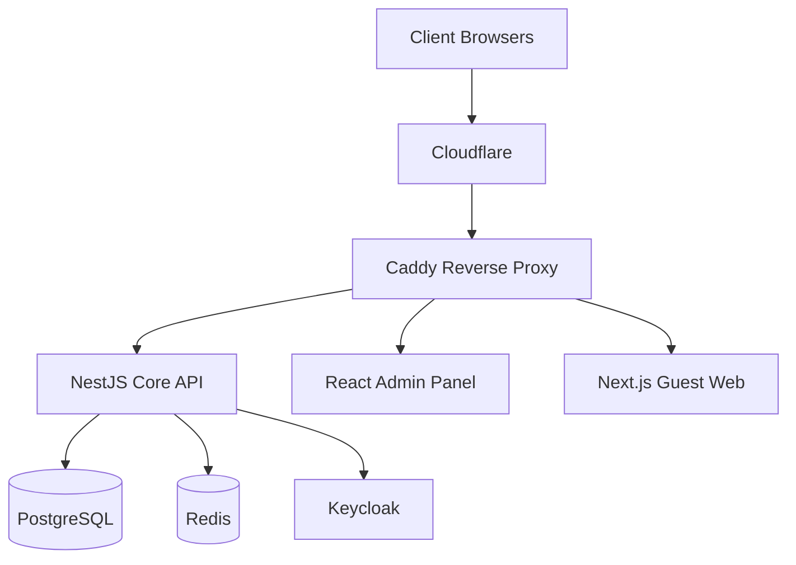

# 🏨 Blueberry HMS (Hotel Management Suite)

**Version:** 1.0.0 (Phase 4 Complete)  
**Property:** Blueberry Hills Resort, Munnar (Mattel Group)  
**Domain:** blueberryhillsmunnar.in  
**Status:** 🟢 Core Revenue System Active

---

## 📖 Table of Contents
1. [Project Overview](#-project-overview)
2. [Architecture](#-architecture)
3. [Technology Stack](#-technology-stack)
4. [Installation & Setup](#-installation--setup)
5. [Database Schema](#-database-schema)
6. [API Documentation](#-api-documentation)
7. [Security & RBAC](#-security--rbac)
8. [Project Roadmap](#-project-roadmap)

---

## 🎯 Project Overview

Blueberry HMS is a production-grade, modular Hotel Management Operating System designed for on-premise deployment. It follows a **Modular Monolith** architecture using **Domain-Driven Design (DDD)**.

### Core Philosophy
- **Data Sovereignty:** Full control over data (Self-Hosted).
- **Strict MVC:** Clean separation of Model, View, and Controller in the API.
- **Audit-First:** Every state-changing operation is logged for compliance.
- **API-First:** Headless architecture supporting Web, Admin, and Kiosk frontends.

---

## 🏗 Architecture

The system runs on **Docker** containers orchestrated via Docker Compose.



---

## 💻 Technology Stack

| Component | Technology | Description |
|-----------|------------|-------------|
| **Backend** | **NestJS** | Node.js/TypeScript framework. Modular and scalable. |
| **Database** | **PostgreSQL 16** | Primary relational data store. |
| **ORM** | **TypeORM** | Database abstraction and migration management. |
| **Auth** | **JWT + Keycloak** | Stateless authentication and Identity Management. |
| **Security** | **Bcrypt** | Password hashing (10 salt rounds). |
| **Infrastructure** | **Docker** | Containerization for consistent deployment. |
| **Proxy** | **Caddy** | Automatic HTTPS and reverse proxying. |

---

## 🚀 Installation & Setup

### Prerequisites
- Docker & Docker Compose
- Node.js (v18+) & pnpm

### Quick Start
1. **Clone & Install:**
   ```bash
   git clone https://github.com/mattel-group/blueberry-hms.git
   cd blueberry-hms
   pnpm install
   ```

2. **Environment Setup:**
   ```bash
   cp .env.example .env
   # Update DB_PASSWORD and JWT_SECRET in .env
   ```

3. **Launch Infrastructure:**
   ```bash
   docker-compose up -d
   ```

4. **Start API:**
   ```bash
   pnpm run dev:api
   ```

5. **Verify:**  
   Health Check: `http://localhost:4000/api/v1/health`  
   Swagger Docs: `http://localhost:4000/api/docs`

---

## 🗄 Database Schema (Key Modules)

### 1. Users & Auth
- **Users:** Stores staff credentials, roles, and status.
- **Audit Logs:** Tracks `who` did `what` and `when`.

### 2. Property & Rooms
- **Properties:** Global resort settings.
- **Room Types:** Categories (Deluxe, Suite) with base pricing and capacity.
- **Amenities:** Features (AC, WiFi) linked to Room Types.
- **Rooms:** Individual inventory (Room 101, 102) with live status.

### 3. Revenue Core (Phase 4)
- **Guests:** Customer profiles, history, and total spend stats.
- **Bookings:** Central reservation record.
  - Links: `Guest` -> `Room` -> `RoomType`.
  - Lifecycle: `DRAFT` -> `CONFIRMED` -> `CHECKED_IN` -> `CHECKED_OUT`.
  - financials: Subtotal, Tax, Total, Paid Amount.

---

## 📚 API Documentation

**Base URL:** `http://localhost:4000/api/v1`

### 🔑 Authentication
- `POST /auth/login` - Get JWT Access Token.
- `POST /auth/register` - Create new staff account.
- `GET /auth/me` - Get current profile (Protected).

### 🏨 Room Management
- `GET /room-types` - List categories and pricing.
- `GET /rooms` - List inventory with status.
- `GET /rooms/available-count` - Real-time availability.
- `PATCH /rooms/:id/status/:status` - Update housekeeping status.

### 📅 Booking Engine
- `POST /bookings/check-availability` - Check dates against inventory.
- `POST /bookings` - Create a reservation.
- `PATCH /bookings/:id/assign-room/:roomId` - Assign physical room.
- `POST /bookings/:id/check-in` - Execute Check-In logic.
- `POST /bookings/:id/check-out` - Execute Check-Out logic.

---

## 🛡 Security & RBAC

### User Roles
1. **SUPER_ADMIN:** Full system access.
2. **OWNER:** Financials and operational oversight.
3. **MANAGER:** Departmental management.
4. **FRONT_DESK:** Bookings, Check-in/out.
5. **HOUSEKEEPING:** Room status updates.
6. **KITCHEN/POS:** F&B operations.

### Security Implementation
- **Validation:** Global Pipes with DTOs sanitize all inputs.
- **Serialization:** Passwords are strictly excluded from all API responses via `@Exclude`.
- **Guards:** Endpoints protected by `JwtAuthGuard` and `RolesGuard`.

---

## 🗺 Project Roadmap

| Phase | Module | Status | Description |
|-------|--------|--------|-------------|
| **1** | **Infrastructure** | ✅ Done | Docker, Postgres, Redis, Repo setup. |
| **2** | **Core & Auth** | ✅ Done | Users, RBAC, Audit Logging, Security. |
| **3** | **Inventory** | ✅ Done | Rooms, Amenities, Pricing structures. |
| **4** | **Booking Engine** | ✅ Done | Reservations, Guest logic, Check-in/out. |
| **5** | **Front Desk UI** | 🚧 Next | React Dashboard for daily operations. |
| **6** | **POS System** | 📅 Planned | Restaurant/Bar billing. |
| **7** | **Website/CMS** | 📅 Planned | Guest booking portal. |
| **8** | **Finance** | 📅 Planned | Invoicing and Reporting. |

---

**Developed for Mattel Group by Technical Team.**
EOF

echo "✅ Updated README.md generated successfully!"
```

---

### **Part 2: Fixing the Test 9 Failure**

The error you received in the previous turn was:
`"message": "Cannot PATCH /api/v1/bookings/"`

**Cause:** The variable `$BOOKING_ID` was empty in your terminal session, so the command became `PATCH .../bookings/` (missing the ID), which is not a valid route.

**Solution:** We need to fetch an existing Booking ID and then run the update command.

Run these commands to verify Phase 4 is 100% working:

#### **1. Fetch a Valid Booking ID**
```bash
# Fetch the most recent booking ID
BOOKING_ID=$(curl -s http://localhost:4000/api/v1/bookings | jq -r '.[0].id')

echo "Found Booking ID: $BOOKING_ID"
```

#### **2. Retry Test 9 (Update Payment)**
```bash
curl -X PATCH http://localhost:4000/api/v1/bookings/$BOOKING_ID \
  -H "Content-Type: application/json" \
  -d '{
    "paidAmount": 11200,
    "paymentMethod": "UPI",
    "status": "CONFIRMED"
  }' | jq
```
*Expected: Status changes to CONFIRMED, PaymentStatus changes to PAID.*

#### **3. Verify Remaining Tests (Check-in/Check-out)**
We need to assign a room before checking in.

**A. Get a Room ID:**
```bash
ROOM_ID=$(curl -s http://localhost:4000/api/v1/rooms | jq -r '.[0].id')
echo "Found Room ID: $ROOM_ID"
```

**B. Assign Room:**
```bash
curl -X PATCH http://localhost:4000/api/v1/bookings/$BOOKING_ID/assign-room/$ROOM_ID | jq
```

**C. Check In:**
```bash
curl -X POST http://localhost:4000/api/v1/bookings/$BOOKING_ID/check-in | jq
```
*Expected: Booking Status: CHECKED_IN*

**D. Check Out:**
```bash
curl -X POST http://localhost:4000/api/v1/bookings/$BOOKING_ID/check-out | jq
```
*Expected: Booking Status: CHECKED_OUT*

---

### **Part 3: Moving Forward**

Once you confirm the manual tests above pass, Phase 4 is officially complete.

**The Backend Core is now fully functional.**
1.  **Users** can login.
2.  **Rooms** exist.
3.  **Guests** can be created.
4.  **Bookings** can be made, paid for, checked in, and checked out.


