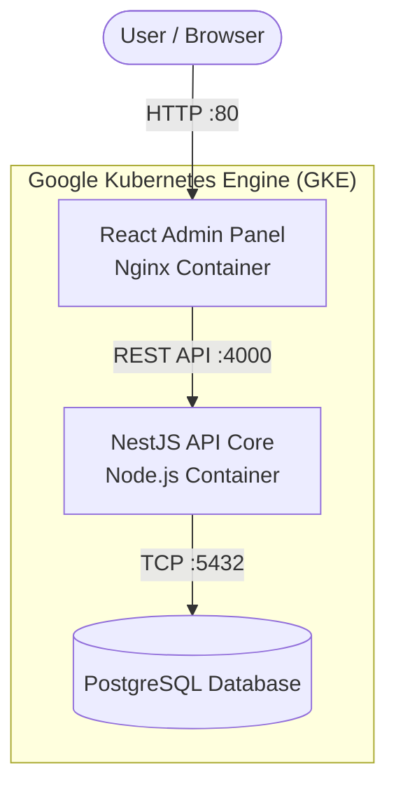

#  Blueberry Hotel Management System (Cloud-Native Capstone)

This repository contains the cloud-native deployment of the Blueberry Hotel Management System (HMS), developed for the **SIT323/SIT737 - Cloud Native Application Development** Capstone Project (Stage 1).

##  Project Scenario
This project implements **Scenario 3: Two-Tier Application Deployment** from the capstone task sheet. It consists of a frontend web interface and a backend REST API communicating securely, backed by a persistent database.

### System Architecture
1. **Frontend (`admin-panel`):** A React Single Page Application (SPA) built with Vite, containerized using a multi-stage Dockerfile, and served via an ultra-lightweight Nginx container.
2. **Backend (`api-core`):** A headless NestJS REST API that handles core hotel business logic.
3. **Database (`postgres`):** A PostgreSQL database utilizing Kubernetes Persistent Volume Claims (PVC) to ensure data persistence across pod restarts.



## 📂 Repository Structure

This project is managed as a monorepo using Turborepo and `pnpm`.

```text
├── apps/
│   ├── admin-panel/        # Vite React frontend application
│   └── api-core/           # NestJS backend REST API
├── services/
│   └── database/           # Postgres initialization scripts
├── Dockerfile.admin        # Multi-stage Docker build for the frontend
├── Dockerfile.api          # Docker build for the backend API
├── docker-compose.yml      # Local development container orchestration
├── cloudbuild.yaml         # CI/CD Pipeline configuration for GCP
└── package.json            # Monorepo dependencies and scripts
```

## 🚀 Technologies Used
* **Containerisation:** Docker (Multi-stage builds for optimization)
* **Container Registry:** Google Artifact Registry / Docker Hub
* **Orchestration:** Google Kubernetes Engine (GKE)
* **CI/CD Automation:** Google Cloud Build / GitHub Actions
* **Application Stack:** React.js, NestJS, PostgreSQL

## 🛠️ Local Development

To run this cloud-native stack locally without deploying to Kubernetes, we use Docker Compose.

### Prerequisites
* [Docker Desktop](https://www.docker.com/products/docker-desktop/) installed and running.
* `pnpm` installed locally (`npm install -g pnpm`).

### Steps to Run
1. Clone the repository:
   ```bash
   git clone https://github.com/YourUsername/SIT737-Capstone-HMS.git
   cd SIT737-Capstone-HMS
   ```
2. Install workspace dependencies:
   ```bash
   pnpm install
   ```
3. Spin up the containers (Database, API, and Frontend):
   ```bash
   docker-compose up --build -d
   ```
4. Access the applications:
   * **Admin Panel:** `http://localhost:8080`
   * **API Core:** `http://localhost:4000`
   * **Database:** `localhost:5432`

To stop the cluster:
```bash
docker-compose down
```

## ☁️ Cloud Deployment (GCP)
This project is designed to be deployed to the Deakin-managed Google Cloud Platform (GCP) environment. 

1. **Continuous Integration:** Pushes to the `main` branch trigger Google Cloud Build (`cloudbuild.yaml`).
2. **Build & Push:** Docker images are built and pushed to Google Artifact Registry.
3. **Deployment:** Workloads are deployed to a Zonal GKE cluster (`e2-small` node) to optimize cloud resource usage under a strict budget constraints.
